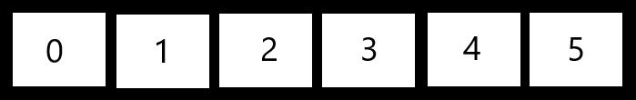

# Big O Notation
##What is big O Notation?
Big O is a way of representing how an algorithm behaves mathematically. 
It is a way of showing the performance of our code in order to know 
how efficient it is. For this we use the notation O(n) where n is the
estimated performance of an algorithm. Since we want to know the performance
of our algorithm independent of any hardware factors we use time steps 
to calculate big O. Consider the following array:

