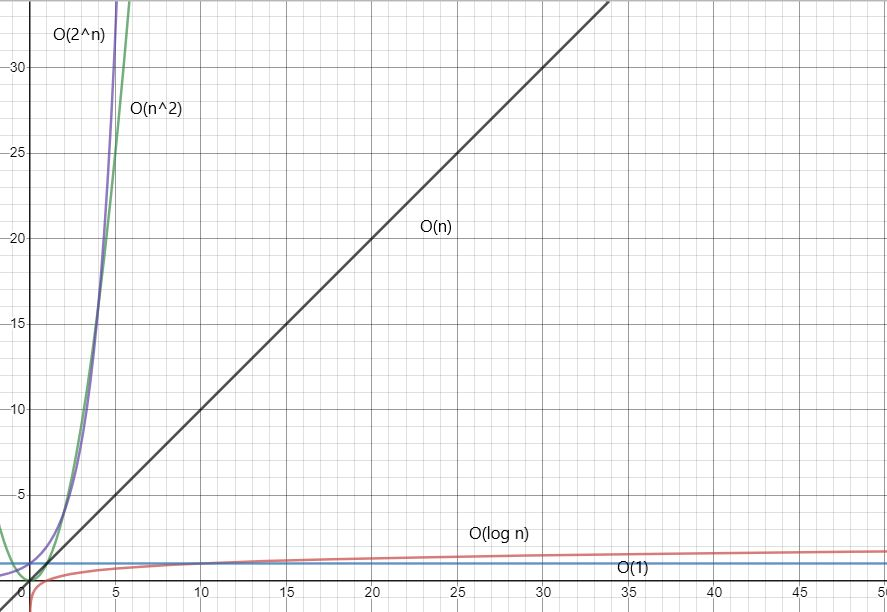

# Big O Notation
##What is big O Notation?
Big O is a way of representing how an algorithm behaves mathematically. 
It is a way of showing the performance of our code in order to know 
how efficient it is. For this we use the notation O(n) where n is the
size of the input related to the number of steps taken to run the
algorithm. Since we want to know the performance of our algorithm 
independent of any hardware factors we use time steps 
to calculate big O. Consider the following array:
\
\


If we want to insert a new item at the beginning of the array, we would
need to shift every item to the right.
\
\

\
\
As you can see there is a bit of work involved to accomplish this.
In order to know just how much work was done we need to first be
familiar with our data structure. Since this is an array in this example
we know that each element can be accessed in O(1) time, and
that writing to an index can also be done in O(1) time. This leaves
us with the following when we insert at the front of this array:\
\
O(1) + O(1) + O(1) + [...] + O(1) + O(1) = O(n)
\
\
Notice how we had to go over every element in the array to accomplish this,
with each step being O(1) time. Therefore we can say the complexity **grows
linearly with the size of the array** resulting in O(n) complexity.
Being familiar with the data structures you are using is key to being
able to calculate their efficiency, as each has different operations allowed
that execute in different amounts of time.
\
## Recognizing Big-O Complexity Types
There are a few main types of Big-O complexity, when computing Big-O
we only care about the upper bound where if the complexity were placed on
a graph it would become an asymptote. Since this is the case coefficients
and small values have little impact on the complexity and can be discarded.
The main types of complexity you will see are:

|   Type:  |    Name:    |           Looks like:           |                  Basic Example:                 |
|:--------:|:-----------:|:-------------------------------:|:-----------------------------------------------:|
|   O(1)   |   Constant  |        A horizontal line.       |             Editing an array index.             |
|   O(n)   |    Linear   |    A line with a slope of 1.    |     A single for loop with trivial contents.    |
|  O(n^2)  |  Polynomial |           A parabola.           |              Two nested for loops.              |
| O(log n) | Logarithmic | A parabola flipped on its side. | A loop that cuts the dataset in half each time. |
|  O(2^n)  | Exponential |      A very steep parabola.     |         Opposite of logarithmic growth.         |     Opposite of logarithmic growth. |



Notice how at lower values of n that the graph has many intersecting lines,
due to this many algorithms run quite quickly with small inputs. However
as we zoom out we see them quickly diverge. The closer you can get your
algorithm to 0(1) the better.
## Calculating Big-O Performance
Consider the following code used as a name generator:

```python
first_names = ["Sam", "Jay", "Sue"]
last_names = ["Desperaux", "MacBeth", "Shakespear"]
for first_name in first_names:
    for last_name in last_names:
        print(first_name, last_name)
#Outputs:
# Sam Desperaux
# Sam MacBeth
# Sam Shakespear
# Jay Desperaux
# Jay MacBeth
# Jay Shakespear
# Sue Desperaux
# Sue MacBeth
# Sue Shakespear
```
Each FOR loop used in this code operates on the entire set of data, meaning 
each loop is running at O(n) efficiency. However, these two loops are nested
inside of one another resulting in:
\
O(n) * O(n)  = O(n^2)
Imagine if there were millions of names you wanted to create these 
permutations of. Each loop would scale at O(n) and the time it took to
run would drastically increase. For this reason it is best to always
seek the most efficient path so that when the data does get big your
algorithm can still perform.

[Return to homepage](README.md)
