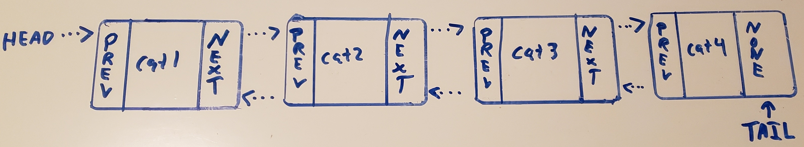

# Linked Lists
Linked lists are a bit different from the Queue structure we just learned
about. Rather than owning a block of memory in a single location, each
element of the list has its own piece of memory which does not need to be
next to another part of the list. To understand this better we will start
by looking at the structure of a linked list to see how it is organized.
## Anatomy of a Linked List
Every linked list knows where it starts and where ends. This is important
since if we do not have this information the list can not be accessed. Given
a high level view of their structure they can appear quite catlike.
Consider the following diagram:


[1](#Sources)

We call the beginning of the linked list the 'head' and the end of the list the
'tail'. In between each of these resides the bulk of the linked list, organized into
what we call nodes. Each of these nodes located between the head and the 
tail store both the value and the address of the next node. Note that both
the head and their tail are their own individual node. When the address stored in
the Node becomes none we have found the tail.

A node can be visualized as the following:


[2](#Sources)

# Variations
## Doubly Linked Lists

[3](#Sources)

There are two main types of linked lists, the first being singly-linked lists,
which we have been discussing up to this point. The second is known as a doubly-linked
list (DLL). The key difference between them is that the DLL also stores a second
address of the previous node. This implementation allows for two way traversal
of the list. This also carries various performance benefits
which we will look at shortly.

If we draw out both types of list they would look like the following:

* Singly-Linked List - Notice how the final node on the tail has it's address
set to None to allow you to know when the end has been reached.


* Doubly-Linked List - Notice how the tail is now able to access the prior
node, allowing for reverse traversal.


* Circular - These types of linked lists have a slight variation, the tail node
stores the address of the head node to be quickly able to go around the list.
We will not cover this type of list in depth here but it is good to be aware
it exists.

# Linked List Complexity
Here is a table comparing SLL to DLL complexitys. When in python we can use the
deque class to implement a DLL, and an example of the operation is provided.

|    Operation:   | SLL: | DLL: |   Python Example: (DLL only)  |                                 Rationale:                                |
|:---------------:|:----:|:----:|:-----------------------------:|:-------------------------------------------------------------------------:|
|   Insert Head   | O(1) | O(1) |     deque.appendleft(data)    |                Only the head node needs changed to insert.                |
| Insert at Index | O(n) | O(n) |  deque.insert(position, data) |                    Must loop until the index is found.                    |
|   Insert Tail   | O(n) | O(1) |       deque.append(data)      | A SLL must loop to the end, but a DLL can adjust the tail address easily. |
|   Remove Head   | O(1) | O(1) |        deque.popleft()        |                Only the head node needs changed to remove.                |
| Remove at Index | O(n) | O(n) |      deque.remove(index)      |                    Must loop until the index is found.                    |
|   Remove Tail   | O(n) | O(1) |          deque.pop()          |     A SLL must loop to the end, but a DLL can adjust the tail address.    |
|     Size of     | O(1) | O(1) |           len(deque)          |                        Size is stored by the class.                       |
|     Is Empty    | O(1) | O(1) |        len(deque) == 0        |                     Easy to check the size against 0.                     |
|     Index of    | O(n) | O(n) | deque.index(item, begin, end) |               Must loop through the list in order to search.              |

Notice how the performance changes depending on the type of list. By gaining access
to the tail via a DLL we can greatly reduce the number of steps required for
various operations.

# Linked List Operations
Since there are no traditional indexes when using a linked list, we need to know
where we are. We typically store this as a variable named 'current'. To enter the
list we need to set current to either be located at the head or tail. From there
we can walk through the list by assigning current to the references in the nodes
with current <- current.next or current <- current.previous. This will set us on track
to access the next nodes.


[4](#Sources)

As a general rule we should always know where the head and tail are in a DLL.
Losing access to this would lose access to the list. This can be tricky so we will
cover a few of the operations.
Performing the operations:
* Insert Head
1. Create a new node.```newnode = Node()```
1. Check if the list is empty. ```self.head is None```
    1. If it is, both the head and tail point to the new node. Success. ```head, tail = newnode```
1. If not point the new node next to the previous head. ```newnode.next = head```
1. Point the previous head to the new node. ```head.previous = newnode```
1. Point head to new node. ```head = newnode``` Success.

* Insert Tail 
1. Create a new node. ```newnode = Node()```
1. Check if the list is empty, if so insert at the head instead. ```insert_head()```
1. Assign previous of new node to the current tail. ```newnode.previous = tail```
1. Assign the old tail next to the new node. ```tail.next = newnode``` Success.

* Insert Middle
1. Create a new node. ```newnode = Node()```
1. Check if the list is empty, if so insert at the head instead. ```insert_head()```
1. Assign the new node previous to current. ```newnode.previous = current```
1. Assign new node next to to the node after current. ```newnode.next = current.next```
1. Assign the previous address of the next node to the new node. ```current.next.previous = newnode```
1. Assign the current node next to the new node. ```current.next = newnode``` Success.
* Remove Head WIP
* Remove Tail WIP
* Remove Middle WIP

# Exercises
* EX 1:
Using the partial linked list class provided, add functionality to it 
to allow you to replace an item in the list. Using that code correct
the phrase "Everybody wants to be a dog - Because a dog is the only dog - Who knows where it's at." to
 "Everybody wants to be a cat - Because a cat is the only cat - Who knows where it's at." [5](#Sources)
```python
class Node:
    def __init__(self, data):
        self.data = data
        self.next = None
        self.previous = None

    def __str__(self):
        return self.data


class LinkedList:
    def __init__(self):
        self.head = None
        self.tail = None

    def __str__(self):
        output = []
        current = self.head
        while current is not None:
            output.append(current.data)
            current = current.next
        return " ".join(output)

    def append(self, data):
        new_node = Node(data)

        if self.head is None:
            self.head = new_node
            self.tail = new_node
        else:
            new_node.previous = self.tail
            self.tail.next = new_node
            self.tail = new_node

    def replace(self, target, value):
        # Your code here.
        pass

ll = LinkedList()
missing_cats = "Everybody wants to be a dog - Because a dog is the only dog - Who knows where it's at."
for word in missing_cats.split(" "):
    ll.append(word)

ll.replace("dog", "cat")
print(ll)
# Correct Outputs:
# Everybody wants to be a cat - Because a cat is the only cat - Who knows where it's at.
```
* EX 2:
Using the linked list class from the prior example, remove cat0 through 9
from the deque and place them into a LinkedList object. Display the new linked list.
```python
from collections import deque

def fill_deque(my_deque):
    for i in range(10):
        my_deque.append("cat" + str(i))

def deque_to_ll(my_deque, cat_list, linked_list):
    # Your code here.
    pass

my_deque = deque()
cat_list = fill_deque(my_deque)
```

#Solutions
1. There are a few ways to solve this problem. One has been provided.
```python
class Node:
    def __init__(self, data):
        self.data = data
        self.next = None
        self.previous = None

    def __str__(self):
        return self.data


class LinkedList:
    def __init__(self):
        self.head = None
        self.tail = None

    def __str__(self):
        output = []
        current = self.head
        while current is not None:
            output.append(current.data)
            current = current.next
        return " ".join(output)

    def append(self, data):
        new_node = Node(data)

        if self.head is None:
            self.head = new_node
            self.tail = new_node
        else:
            new_node.previous = self.tail
            self.tail.next = new_node
            self.tail = new_node

    def replace(self, target, value):
        current = self.head
        while current is not None:
            if current.data == target:
                current.data = value
            current = current.next

ll = LinkedList()
missing_cats = "Everybody wants to be a dog - Because a dog is the only dog - Who knows where it's at."
for word in missing_cats.split(" "):
    ll.append(word)

ll.replace("dog", "cat")
print(ll)
# Correct Outputs:
# Everybody wants to be a cat - Because a cat is the only cat - Who knows where it's at.
```

#### Sources:
1. Mr. Scruffles
1. <a name = "image3"></a>https://www.google.com/url?sa=i&url=https%3A%2F%2Fwww.pinterest.com%2Fpin%2F838091811897583826%2F&psig=AOvVaw3SpZF-kfkwELuiYGLWW_24&ust=1607204720956000&source=images&cd=vfe&ved=0CAIQjRxqFwoTCOD0va2mte0CFQAAAAAdAAAAABAL
1. <a name = "image1"></a>https://www.reddit.com/r/ProgrammerHumor/comments/fbbdl3/linked_cat/
2. <a name = "image2"></a>https://www.catster.com/wp-content/uploads/2019/05/Two-orange-ginger-tabbies-wrestling-fighting-and-biting.jpg
1. Sherman, Richard M., 1928-. Walt Disney's Aristocats: Vocal, United States: Milwaukee, WI :Wonderland Music Co. and Walt Disney Music Co