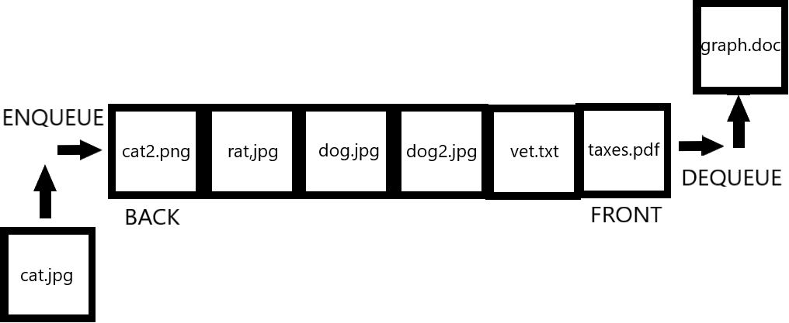
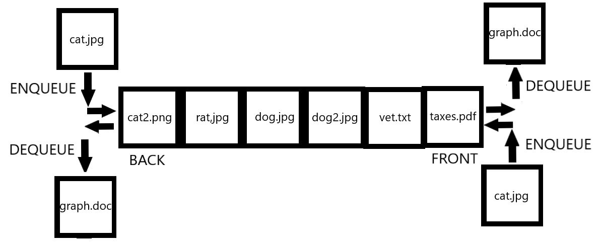

#Queues
A queue is a data structure where the first item to enter the Queue is also
the first to leave. We call this a FIFO structure, meaning First-In First-Out
or FIFO. Think of this as a lunch line at school, kids join the line at
the back and then leave from the front when they reach the lunch counter.
## Structure of a Queue
A queue consists of a back and a front. As data enters (Enqueues) from the back it
moves through the body of the queue until it reach the front where it can be used
and removed. (Dequeue)

Queues are quite common in real life, your printer uses one to maintain order
when multiple documents are sent to be printed at once. Consider the following
image representing a simple queue:



As data, in this context files to be printed, enter the queue from the back, they
are moved forward as other files are dequeued from the front. Notice how
the files can only move in one direction.

When you need to maintain order it is best to use a Queue since this will 
ensure that no data is allowed to be used before it has reached the front
of the Queue.

#### Deque
Not all queues are created equal. There are variations to the queue that allow for different
operations, one of which we will look at briefly is called a Deque. This type of
queue sports a slightly different structure to a normal Queue. This type of queue allows
enqueing and dequeueing from both the back and front of the Deque in O(1) time
from both ends.

The structure of a deque is represented in the following image:



For this discussion we will focus mainly on the regular Queue, but it is worth
noting that both types of Queue have their own use cases. If you need to work from
the front of the Queue as a well as the back a Deque will work nicely.

##Common Queue Operations and Complexity
As you may have noticed, Queues only allow for certain operations. There is no
need for a Queue to have the ability to insert in the middle since this
would break the rules of the Queue. Here are the common queue operations:

| Operation:  |                Function:                | Complexity: |                      Performance rationale:                     |
|:-----------:|:---------------------------------------:|:-----------:|:---------------------------------------------------------------:|
|   Enqueue   |      Add a value to the queue back.     |     O(1)    | Adding a value to a queue is simple, no data needs to be moved. |
|   Dequeue   |   Remove the value at the queue front.  |     O(n)    |              All data must shift forward one slot.              |
|   Size of   |        Returns the queue length.        |     O(1)    |              Queues store the size for easy access.             |
|   Is empty  | Boolean returns True if queue is empty. |     O(1)    |     Empty can be easily checked based on items in the Queue.    |

Queue operations allow for new items to be quickly added to the back. However, it is
not as easy to remove the item from the front, so if your task involves alot of
front end heavy operation and does not require a certain order, it would be advisable
to look for an alternate data structure or even a deque. (Double Ended Queue)

Many queue operations have varying names in different languages, however they all
work mostly the same way. In the next section we will look at how one could
be used with Python.

## Python Queues
In Python there are two main options for creating a Queue. You could create one using the built in
deque class stored in collections. However for our purposes we will look at implementing one using a list [].

In order to simulate the operations of a Queue we will make use of the abilities of a list.

| Queue Operation |    Python List Equivalent    |
|:---------------:|:----------------------------:|
|     Enqueue     |        queue.append()        |
|      Deqeue     | item = queue[0], del queue[0] |
|     Size of     |          len(queue)          |
|     Is empty    |        len(queue) == 0       |

It is important to remember that when using the dequeue format for a list that
you store the item either where it belongs or into a temporary variable before you
delete it. Not doing so would result in your data being lost.

Here is a simple program demonstrating how to fill and make use of the values
once they are store in the Queue:

```python
# Start with an empty list.
queue = []
# Enqueue desired values.
queue.append(1)
queue.append(2)
queue.append(3)
queue.append(4)
# Dequeue the Values for use.
while len(queue) > 0:
    # Store the item and remove it from the queue.
    item = queue[0]
    del queue[0]
    print(item)

#Outputs:
# 1
# 2
# 3
# 4
```
Pay attention to how the items we added to the Queue came out in the same order.
Each one was removed from the Queue resulting in the next item becoming the new front.
What if we wanted to read these items back in reverse? Lets modify this program to
do just that.

```python
# Start with an empty list.
queue = []
# Enqueue desired values.
queue.append(1)
queue.append(2)
queue.append(3)
queue.append(4)
# Create a list for temporary storage.
my_list = []
# Dequeue the Values for use.
while len(queue) > 0:
    # Store the item and remove it from the queue.
    item = queue[0]
    del queue[0]
    # Store the item.
    my_list.append(item)

# Store the items into the Queue in reverse.
while len(my_list) > 0:
    queue.append(my_list.pop())

print(queue)
#Outputs:
#[4, 3, 2, 1]
```

Did you see how that worked? As we removed valued from the Queue we were able
to store them and then place them back into the Queue. Because we knew they were
sorted this resulted in them being reversed upon being placed back into the
Queue.

Lets apply what we have learned and practice it.

## Practice Problems:
1. Write a program that asks a user to input their favorite sentence. Store
this sentence into a queue and tell the user how many characters are in their
favorite sentence, spaces should not be included. To accomplish this you may
need to find a way to remove spaces from the queue. A solution is provided at
the bottom of the page.

2. Complete code to take the first n items from the front of the queue and
add them to the back. n is a number of items supplied by the user of the program.
You should check to make sure there are more than n items in the queue already
before accepting the user input. A template is provided, but the solution will
be your own.

```python
# Start with an empty list.
queue = []
# Enqueue desired values.
for i in range(1, 10):
    queue.append(i)

# Ask the user how many values should be swapped.   
num_values_to_swap = input("How many values should be removed and placed on the back of the Queue: ")
# YOUR CODE HERE
```

* Problem 1 Solution:
```python
# Start with an empty list.
queue = []

sentence = input("Enter your favorite sentence: ")

#Store the sentence in the queue.
for character in sentence:
    queue.append(character)

# Loop through the entire queue.
count = 0
while count < len(queue):
    a_char = queue[0]
    del queue[0]

    # Store the char back into the queue if it is not a space.
    if a_char != ' ':
        queue.append(a_char)
    count += 1

# Access the size of the Queue without spaces with len().
print(len(queue))
```
From this solution notice how we can utilize the len() ability to work
with the size of the Queue. This allows us to know when we should stop
removing values from the Queue as every value has been checked for a space
at this point in time. Once you complete problem number 2 return to the homeapge to
learn about our next topic, linked lists.

[Return to homepage](README.md)