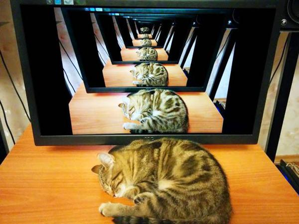

# Recursion
Up until now you have probably used functions by calling other functions to
perform a portion of the required work. Recursion varies from this, instead
of utilizing separate functions to get the job done, the same function calls itself.
Each call gets smaller and smaller until the problem is solved, as shown in the
mirrored cat image below.


[1](#Sources)

This allows you to essentially create a loop without using one of the more common iterative
approaches. Any recursive approach can also be written iteratively, however
it is best to analyze the recursive approach before implementing it since
there are more areas where things can wrong. 

## Putting Recursion to Work
In order to apply recursion we need to break the problem at hand down into
smaller parts, a base case and a recursive case.
1. Base case - A simple step that can be solved without recursion, when this 
case completes the algorithm should stop.
1. Recursive case - Break the problem down in terms of itself. Each recursive
call should work on a smaller subset of the original problem.

Each time you make a new call you are adding another layer to the call stack.
If the recursive algorithm is inefficient and runs too long it will result
in a stack overflow.

Consider if we wanted to write a program to calculate the sum of numbers up to
a user input n. Where would we want to stop? Since there are no numbers useful to us
below 1 in this case, we can consider when n < 1 to be our base case.

```python
def sum_up_to(n):
    if n < 1:
        return 0
```
Since we returned a value the function will now stop calling itself when n becomes
small enough to meet our base case. Now we need to define a recursive case. We are creating
a sum of numbers, so in order to make the recursive case smaller each time we can use
n - 1.

```python
def head_sum_up_to(n):
    if n < 1:
        return 0
    else:
        return head_sum_up_to(n - 1) + n

n = int(input('Enter a number n: '))
print(head_sum_up_to(n))
```

This method is known as head recursion. Simply put since the recursive call
takes place immediately following the base case check, and the sum is computed
after the recursive call has finished with + n. The call stack is first create and
then the calculation occurs as each call returns. We can also do this via tail 
recursion.

 [2](#Sources)

Rather than having the recursive call compute after the call stack collapses,
we can have it compute as it build with tail recursion. This way when the call
stack unwinds, it already has the answer. Some compilers may optimize for this
methodology, so it is good to research based on your chosen language.

```python
def tail_sum_up_to(n):
    if n < 1:
        return n

    return tail_sum_up_to(n - 1) + n

n = int(input('Enter a number n: '))
print(tail_sum_up_to(n))
```

## Memoization
When you have a calculation that begins to generate an oversized call stack,
you can sometimes store the values you already know via memoization. If your
recursive algorithm runs poorly in e.g. O(2^n) time there may be a chance to memoize 
it. You can do this by:
1. Create a storage variable, a dictionary, or other type to cache the data.
1. When the function is called:
    1. Return the item if it is in storage.
    1. Otherwise compute the the item.
    1. Store the new computed item into the cache.

You can often tell whether or not memoization can be applied by checking if
the function will always return the same result for the same inputs. If it does
it is worth looking to see if memoization can be of use.

[Return to homepage](../README.md)

## Sources:
1. https://recursivelyrecursive.files.wordpress.com/2015/04/cat.jpg
1. http://katherinewintsch.com/wp-content/uploads/2017/01/Resting-cat.jpg