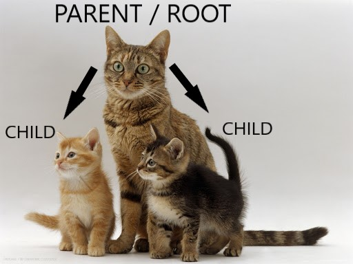
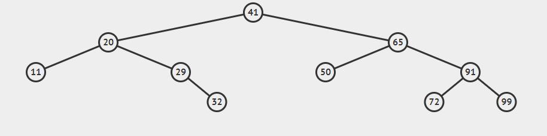
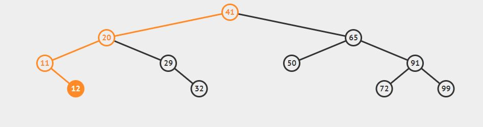
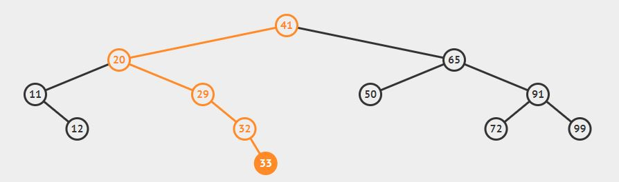
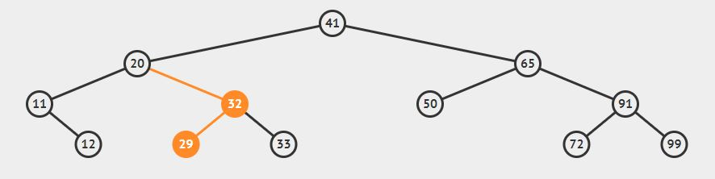

# Trees
Trees begin at a **root** and are composed of **nodes**. Each node stores
its own data and the addresses of its **children**. This creates
a hierarchy for each of the individual nodes. This structure can be
useful in areas such as database indexes, file compression, and autocompletion
algorithms. Unlike the Linked List nodes
we diagrammed earlier the structure of tree nodes look a bit more like the following:


[1](#Sources)
```python
class Node:
    def __init__(self, value):
        self.value = value
        self.left = None
        self.right = None
```
The **root** is the first Node of any tree, and the first Node of any subtree
is a **parent**, along with any node that has children. 
Each Node may have any amount of children. If a Node has no Children it is
referred to as a **leaf node**. Trees can also support reverse lookup by allowing
a child node to store the address of it's parent. If each parent node only
allows for two child nodes, the tree becomes known as a **binary tree**.

## Binary Search Trees
**Binary Search Trees** allow for quick lookup of the data they store. In a
BST the value of a node is always greater than the child on the left, and less
than the value of the child on the right. ```left child < parent < right child```
This rule applys to all subtrees. 

If we follow this rule and ensure that the maximum distance from the root, known as
the **height** of the tree is the same on either side, we can discard half of the 
tree when searching. This results in an O(n/2) operation or O(log n). Here is a
diagram of a balanced BST:



For this tree we would say the height is 4 as the longest distance from the root is
41-65-91-99 or 41-20-29-32. We can also say that the height of 32 from 29
is 2. This is distance from either the root or the chosen subtree parent.

If we want to insert a value the operations we would need
to follow are the following:



1. Starting at the root, compare the inserting value to the root value.
In this case, our value is lower so we go left.
1. Compare the value to the left child, if no child exists, insert it. Since 12 is
less than 20, we stay left.
2. Compare the value to the following nodes until you find an empty spot. In this case
our value is greater than 11, so we go right and insert at the open location.

## Tree Operations
As long as the difference in height of each branch of the tree from root
is 1 or less the basic operations of a tree can be done in the following
times:

|  Operation: | Performance |                             Rationale:                            |
|:-----------:|:-----------:|:-----------------------------------------------------------------:|
|    Delete   |   O(log n)  |                Each pass cuts the tree in half n/2.               |
|     Find    |   O(log n)  |               Need to lookup where the node belongs.              |
|    Insert   |   O(log n)  |                 Need to lookup the node to delete.                |
| Height From |  O(log n)    | Need to find the highest child and subtract from the root height. |

In order to walk through a tree for many of these operations we will use recursion. We can define
a smaller part of a tree as a node. We will use this to our advantage to access
each child node recursively via ```node.left``` and ```node.right```. Consider the
following implementation of function to insert values into a tree:

```python
class Tree:
    def __init__(self):
        self.root = None

    def insert(self, value):
        self._insert(value, self.root)

    def _insert(self, value, node=None):
        if self.root is None:
            self.root = Node(value)
        else:
            if value < node.value:
                if node.left is None:
                    node.left = Node(value)
                else:
                    self._insert(value, node.left)
            else:
                if node.right is None:
                    node.right = Node(value)
                else:
                    self._insert(value, node.right)
```
Getting around a tree iteratively can be quite difficult, hence we take a 
recursive approach and break the problem down. Each time we come to a branch in the
tree we make a decision based on values to go either right or left.

When we want to traverse a tree, whether forwards or backwards this same methodology applies.
Consider this implementation deigned to display the values in a tree:

```python
    def display(self):
        self._display(self.root)

    def _display(self, node):
        if node is not None:
            print(node.value)
            self._display(node.left)
            self._display(node.right)
```

This method will traverse the entire tree, displaying each value as it goes
through the branches. We have a smaller problem of accessing each node, and our
base case has become to exit whenever we find a node that is None, indicating the
end of that branch.

## AVL Trees
Since working with data that is often sorted would result in wildly unbalanced trees where
all the data goes either all right or all left, algorithms exist to balance a tree.
One of these is known as the **Adelson-Velskii and Landis tree** (AVL Tree). These maintain
the height of the tree automatically, and in order to do so they find the middle
value of the tree to balance off of.

If we insert a value of 33 to our earlier tree, we now have a height difference, which
while minor in this case, can still be optimized by an AVL tree. The values of this branch of
the tree are 29, 32, and 33. This mean that 32 is our middle value in the case that we will
balance around.



We can now use 32 as our balance point and rotate the references so that the height
difference is resolved.



## Practice Problems
* (1) Your cat wants to climb the christmas tree. If the tree is unbalanced it will
fall over. Add code to the tree class from this tutorial to check if the left
and right sides are balanced in height. Since the cat will add 1 to the side
of the tree it climbs, the cat may only climb the tree if both
branches are exactly equal.
Report whether or not the cat can climb the tree.


[3](#Sources)

```python
class Node:
    def __init__(self, value):
        self.value = value
        self.left = None
        self.right = None

class Tree:
    def __init__(self):
        self.root = None

    def insert(self, value):
        self._insert(value, self.root)

    def _insert(self, value, node=None):
        if self.root is None:
            self.root = Node(value)
        else:
            if value < node.value:
                if node.left is None:
                    node.left = Node(value)
                else:
                    self._insert(value, node.left)
            else:
                if node.right is None:
                    node.right = Node(value)
                else:
                    self._insert(value, node.right)

    def display(self):
        self._display(self.root)

    def _display(self, node):
        if node is not None:
            print(node.value)
            self._display(node.left)
            self._display(node.right)

christmas_tree = Tree()
christmas_tree.insert(5)
christmas_tree.insert(4)
christmas_tree.insert(6)
christmas_tree.insert(3)
christmas_tree.insert(7)
```

* (2) Now that you have your christmas tree set up, you want to find out how many parts of the tree
you can hang ornaments on. Add code to the tree class to find out how many nodes in the tree are available for 
hanging ornaments. Starter code is provided.

```python
    def size_of(self):
        # Your code here.

    def _size_of(self, node):
        #Your code here.


christmas_tree = Tree()
christmas_tree.insert(5)
christmas_tree.insert(4)
christmas_tree.insert(6)
christmas_tree.insert(3)
christmas_tree.insert(7)
christmas_tree.insert(8)
christmas_tree.insert(9)
christmas_tree.insert(10)
```

## Solutions
Problem 1:
The following code should be added to the tree. You need a way to determine
the height of each branch and compare it. This will allow you to determine if 
the cat can climb the tree.
```python
    def height_of_branches(self):
        if self.root is None:
            return 0
        else:
            return self._height_of_left(self.root), self._height_of_right(self.root)

    def _height_of_left(self, node):
        if node is None:
            return 0
        else:
            return self._height_of_left(node.left) + 1

    def _height_of_right(self, node):
        if node is None:
            return 0
        else:
            return self._height_of_right(node.right) + 1

christmas_tree = Tree()
christmas_tree.insert(5)
christmas_tree.insert(4)
christmas_tree.insert(6)
christmas_tree.insert(3)
christmas_tree.insert(7)

height = christmas_tree.height_of_branches()
if height[0] == height[1]:
    print("Your cat can safely climb the tree.")
else:
    print("You cat would cause the tree to fall over.")
```

Problem 2:
```python
class Node:
    def __init__(self, value):
        self.value = value
        self.left = None
        self.right = None

class Tree:
    def __init__(self):
        self.root = None

    def insert(self, value):
        self._insert(value, self.root)

    def _insert(self, value, node=None):
        if self.root is None:
            self.root = Node(value)
        else:
            if value < node.value:
                if node.left is None:
                    node.left = Node(value)
                else:
                    self._insert(value, node.left)
            else:
                if node.right is None:
                    node.right = Node(value)
                else:
                    self._insert(value, node.right)

    def display(self):
        self._display(self.root)

    def _display(self, node):
        if node is not None:
            print(node.value)
            self._display(node.left)
            self._display(node.right)

    def height_of_branches(self):
        if self.root is None:
            return 0
        else:
            return self._height_of_left(self.root), self._height_of_right(self.root)

    def _height_of_left(self, node):
        if node is None:
            return 0
        else:
            return self._height_of_left(node.left) + 1

    def _height_of_right(self, node):
        if node is None:
            return 0
        else:
            return self._height_of_right(node.right) + 1

    def size_of(self):
        if self.root is None:
            return 0
        else:
            return self._size_of(self.root)

    def _size_of(self, node):
        if node is None:
            return 0
        else:
            return self._size_of(node.left) + self._size_of(node.right) + 1


christmas_tree = Tree()
christmas_tree.insert(5)
christmas_tree.insert(4)
christmas_tree.insert(6)
christmas_tree.insert(3)
christmas_tree.insert(7)
christmas_tree.insert(8)
christmas_tree.insert(9)
christmas_tree.insert(10)

branches = christmas_tree.size_of()
print(f"Your tree has {branches} branches available for hanging ornaments.")
```
Notice how for each recursive pass we only want to add one once. This will allow us to know the correct size of the tree
when the recursive call returns, each layer will add one. You coud also implement the tree class to store the size as each
node is added to tree, which would negate the need to traverse the entire tree to define its size.

[Return to homepage](../README.md)

### Sources
1. http://cats.ava7.com/domestic-cat/mother-cat-with-two-of-her-6-week-kittens.html
1. www.visualgo.net/bn/
1. https://static.boredpanda.com/blog/wp-content/uploads/2015/12/decorating-cats-destroying-trees-christmas-61__605.jpg